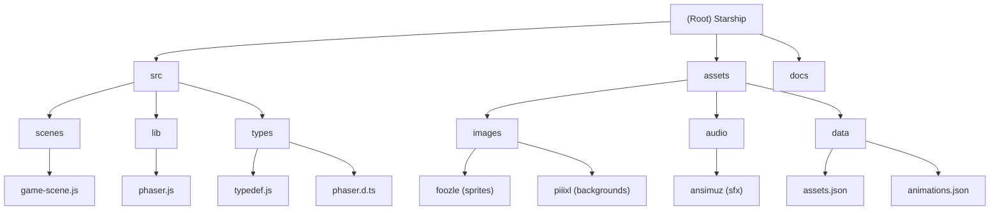

# Starship - Phaser 3 Space Shooter

## Changelog
- **2025-09-24**: Initial AI context setup with project structure analysis and documentation generation

## Project Vision
An arcade-style space shooter game built with Phaser 3, featuring player-controlled spaceship combat against enemy ships with smooth animations, sound effects, and responsive gameplay mechanics.

## Architecture Overview
This is a browser-based JavaScript game using the Phaser 3 framework with a modular ES6 structure:

- **Framework**: Phaser 3 Canvas renderer with Arcade Physics
- **Architecture**: Single-scene game with modular component system
- **Asset Management**: JSON-configured sprite sheets and audio files
- **Game Loop**: Standard Phaser scene lifecycle (preload → create → update)
- **Input**: Keyboard controls (arrow keys + spacebar)

### Key Technologies
- Phaser 3 (Game Engine)
- ES6 Modules
- Canvas API
- Arcade Physics Engine
- JSON Asset Configuration

## Module Structure Diagram

## Module Index

| Module | Path | Type | Description |
|--------|------|------|-------------|
| **Source** | `src/` | Code | Main game source code including scenes, types, and framework integration |
| **Assets** | `assets/` | Resources | Game assets including sprites, audio, backgrounds, and configuration data |
| **Documentation** | `docs/` | Media | Demo GIFs and documentation assets |

## Running and Development

### Prerequisites
- Modern web browser with ES6 module support
- Local web server (recommended: VS Code Live Server extension)

### Local Setup
1. Open project in VS Code (or preferred IDE)
2. Install Live Server extension for VS Code
3. Right-click `index.html` and select "Open with Live Server"
4. Game will open in browser at `http://localhost:5500`

### Development Workflow
- Main entry point: `index.html` → `src/main.js`
- Game configuration in `src/main.js` (canvas settings, physics, scene management)
- Game logic in `src/scenes/game-scene.js`
- Asset loading via `assets/data/assets.json`
- Animation definitions in `assets/data/animations.json`

## Testing Strategy
Currently no automated testing framework is implemented. Testing is manual through:
- Browser developer tools for debugging
- Physics debugging enabled in game configuration
- Live reload during development

## Coding Standards
- ES6 modules with explicit imports/exports
- JSDoc type definitions for game objects
- Phaser 3 best practices for scene management
- Organized asset loading through JSON configuration
- Modular component architecture planned (health, collider components)

## AI Usage Guidelines
- Maintain existing Phaser 3 patterns and conventions
- Preserve asset attribution and licensing information
- Follow ES6 module structure
- Use provided JSDoc type definitions
- Reference existing asset and animation configurations

## Game Features (Current/Planned)
- **Current**: Basic scene setup, asset loading, "Hello World" display
- **Planned**: Player ship movement, enemy ships, projectiles, collision detection, health system, animations, sound effects

## Controls
| Keys | Description |
|------|-------------|
| Arrow Keys (Left/Right) | Move player ship |
| Spacebar | Fire weapon |

## Asset Credits
- **Player/Enemy Ships**: Foozle (Void series asset packs)
- **Sound Effects**: Ansimuz (Warped Space Shooter)
- **Background**: Piiixl (Space Background)